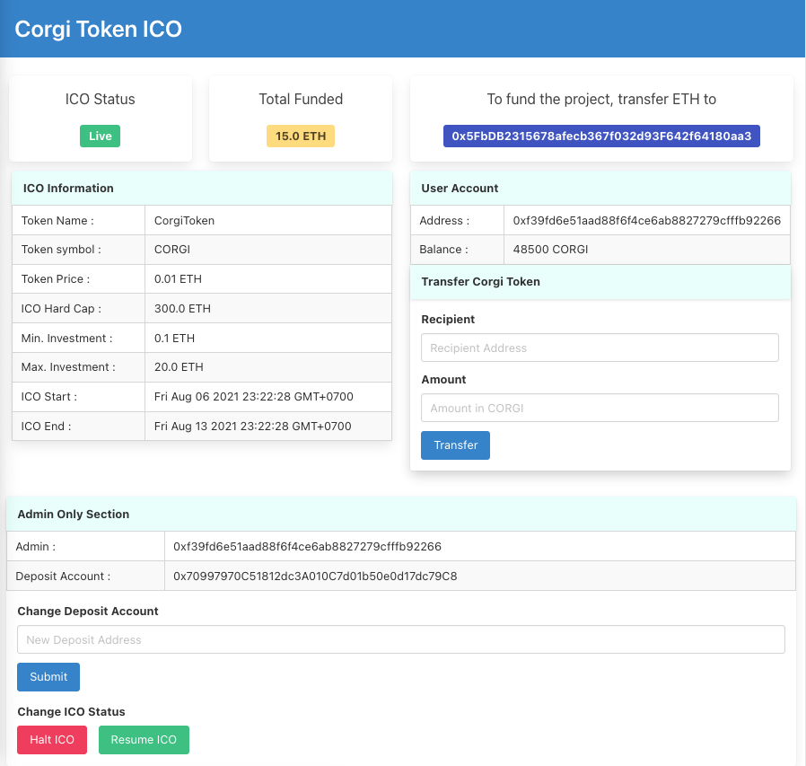

# Corgi Token ICO
An ERC-20 Token ICO Dapp with implementation from OpenZeppelin's ERC-20 smart contracts. The project was developed using [Hardhat](https://hardhat.org), with smart contracts written in Solidity. The Dapp was tested and deployed to both local and Ropsten test networks.

[Link to Demo Video](./documentations/demo_video)

# 

## Tech
